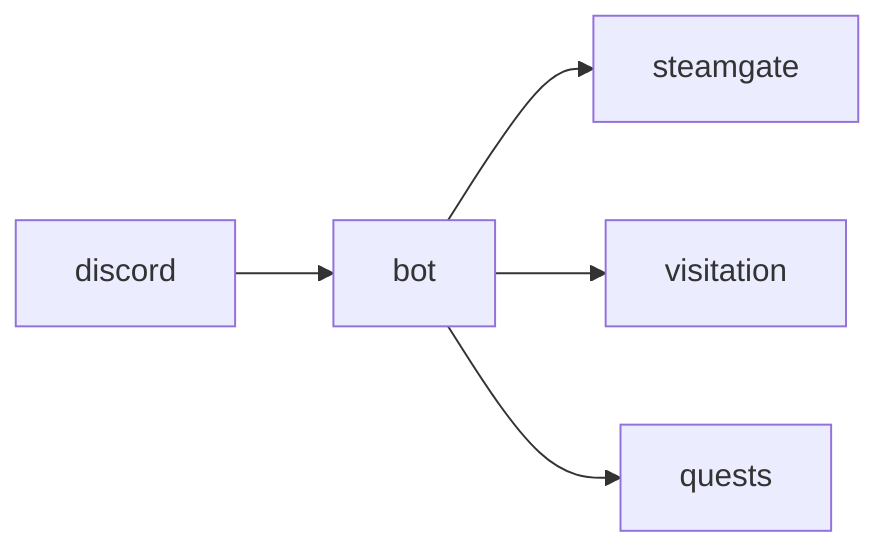

# Discord

**Discord Bot** — Companion bot linking Discord channels to pet status, away-alerts, and visit invites.

Part of [ComputerPets](https://github.com/RicheyWorks/computerpets). Map: [computerpets-ecosystem](https://github.com/RicheyWorks/computerpets-ecosystem).

| | |
| --- | --- |
| Status | Design scaffold — contract frozen, implementation next |
| License | MIT |
| First pet | Still [Rui on the desktop](https://github.com/RicheyWorks/computerpets/blob/main/docs/START-HERE.md). This organ is optional. |

## The job

If Rui walks away from neglect, Discord can tap you. If a friend invites a visit, it lands in a channel — not an email.

The flagship overlay already puts a living sticker on the real desktop (Rui first, 210 kinds). Discord does not replace that. It is one organ.

## Who uses it

Players who want away-alerts in a channel.

## What it is not

Not a moderation bot for random guilds. Unlinked users get an ephemeral how-to, not a scan.

## Architecture



## Stack

TypeScript · discord.js · slash commands · Steamgate link · presence webhooks

GroupId / namespace: `com.enterprisepet.discord`  
Default listen: `3001`

## Contract

### Data

`Binding(discordId, steamId) · Alert(kind, channelId) · SlashAck(ephemeral)`

### Surface

- /link — bind Discord user to Steam / wallet
- /status — vitals for your active pet
- /recall — call a visiting pet home
- webhook pet.away — posted to a chosen channel

### Failure doctrine

Unlinked user → ephemeral how-to, no scan of the guild. Token leak rotation in Console. Rate limits → queue alerts 30s.

## First slice

Build this and stop. Do not boil the ocean.

**/link /status /recall + webhook `pet.away`.**

You know it works when: Token rotation documented in Console. Rate-limit queues alerts 30s. No guild-wide PII dump.

## Environment

`DISCORD_TOKEN`, `STEAMGATE_URL`, `PUBLIC_BASE`

Never commit secrets. Never put Steam or chain keys in the overlay.

## Neighbors

- computerpets-visitation
- computerpets-steamgate
- computerpets-quests
- computerpets-bounty

## Layout

```
computerpets-discord/
  README.md           this file
  LICENSE             MIT
  docs/CONTRACT.md    the same contract, frozen for implementers
  src/                implementation lands here
```

## Run (Windows)

PowerShell, from this folder, after the flagship helpers (Git, Node LTS 22+, JDK 21 as needed):

```powershell
cd bot; npm install; npm run start
```

You do not need this service to meet Rui. The [flagship start-here](https://github.com/RicheyWorks/computerpets/blob/main/docs/START-HERE.md) is still the first pet.

## Links

- Flagship: [RicheyWorks/computerpets](https://github.com/RicheyWorks/computerpets)
- This repo: [RicheyWorks/computerpets-discord](https://github.com/RicheyWorks/computerpets-discord)
- Map: [RicheyWorks/computerpets-ecosystem](https://github.com/RicheyWorks/computerpets-ecosystem)
- Contract file: [docs/CONTRACT.md](docs/CONTRACT.md)

## License

MIT. See [LICENSE](LICENSE).

---

*Two hundred ten living kinds. Keep them so a line does not go quiet.*
